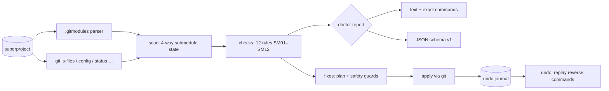

# submend

[English](README.md) | [中文](README.zh.md) | [日本語](README.ja.md)

[](LICENSE) [](go.mod) [](CHANGELOG.md)  [](CONTRIBUTING.md)

**submend：オープンソースの git submodule ドクター——detached HEAD・URL ドリフト・ダーティな作業ツリーを安定したチェック ID で診断し、すべての所見を説明し、取り消し可能な安全な修復だけを適用します。**


```bash
git clone https://github.com/JaydenCJ/submend && cd submend
go build -o submend ./cmd/submend    # single static binary, stdlib only
```

> プレリリース：v0.1.0 はまだどのパッケージレジストリにも公開されていません。上記のとおりソースからビルドしてください（Go ≥1.22 なら可）。

## なぜ submend？

Submodule は git の中で最も恐れられている機能であり、monorepo から脱出したチームも依然としてそれを抱えています。故障モードはいつも同じです——`.git/config` は決して `.gitmodules` を読み直さないため、同僚のクローンは移転済みの古い URL からフェッチし続ける。ローカルの実験が submodule を「1 コミット先行」にし、以後すべての diff にあの厄介な *new commits* ノイズが混ざる。detached HEAD が実作業への唯一の参照をひっそり握ったまま、次の `submodule update` で置き去りになる。git 純正のツールが与えてくれるのは、1 文字の接頭辞では何も説明しない `git submodule status` か、守りたかったはずのコミットを平気で捨てるハンマー `git submodule update --init --force` だけ。submend はハンマーではなく医者です：submodule が存在する 4 つの場所（`.gitmodules`、`.git/config`、インデックスの gitlink、作業ツリーのクローン）をすべて読み、あらゆる食い違いを具体的な証拠つきの安定チェック ID として報告し、データ損失へのガードを備えた修復だけを適用します——各操作はジャーナルに記録され、`submend undo` で元の状態に戻せます。

| | submend | git submodule status | git submodule update --init --force | シェルエイリアス / wiki の秘伝 |
|---|---|---|---|---|
| URL ドリフト検出（.gitmodules vs .git/config vs origin） | ✅ 3 箇所すべて、相対 URL も | ❌ | ❌ 盲目的な同期のみ | ❌ |
| 所見の説明（安定 ID・背景・処方） | ✅ `explain SM01`–`SM12` | ❌ `+`/`-`/`U` 接頭辞のみ | ❌ | ❌ |
| 未コミットの作業と到達不能コミットの保護 | ✅ ガードつき、理由を添えて拒否 | 読み取り専用 | ❌ `--force` は破棄する | ❌ |
| 適用した修復ごとの取り消し | ✅ ジャーナル + `submend undo` | 対象外 | ❌ | ❌ |
| 機械可読な出力 | ✅ バージョンつき JSON | ❌ | ❌ | ❌ |
| ランタイム依存 | 0（Go 標準ライブラリ + あなたの git） | 0（組み込み） | 0（組み込み） | まちまち |

<sub>2026-07-13、git 2.43 で確認：`git submodule status` は `+`/`-`/`U` の状態接頭辞しか表示せず、`update --force` のドキュメントは「別のコミットへ切り替える際に submodule のローカル変更を破棄する」と明記しています。</sub>

## 特長

- **12 の的を絞ったチェック、安定 ID** —— SM01–SM12 が、未初期化パス、config/remote 両方の URL ドリフト、記録とずれたチェックアウト（先行/後退カウントつき）、アタッチ可能な detached HEAD、どのブランチにも乗っていない孤立コミット、ダーティな作業ツリー、孤児 gitlink と孤児 `.gitmodules` エントリ、埋め込み `.git` ディレクトリ、クローンに存在しない記録コミットまでカバー。
- **フラグを立てるだけでなく説明する** —— `submend explain SM06` は、その所見が何を意味し、なぜ人の作業を失わせ、修復が何を実行し、その修復がどう取り消されるかを教えます。`doctor` は実行予定の正確なコマンドをそのまま表示。
- **設計からして安全** —— 修復はダーティな作業ツリーを拒否し、コミットを孤立させるチェックアウトを拒否して（代わりにレスキューブランチを提案——SM06 発火時には自ら作成）、未コミットの作業には決して触れません。
- **本物の undo つきで可逆** —— 適用された各アクションは正確な逆コマンドとともに `.git/submend/journal.json` に記録され、`submend undo` が新しい順に再生します。一方向の修復（absorbgitdirs）は偽装せず、そのままラベル表示。
- **相対 URL に誠実** —— `../dep.git` はドリフト比較の前に git 自身の規則でスーパープロジェクトの origin に対して解決され、origin がなければ誤検知するのではなくチェック側が身を引きます。
- **スクリプト対応** —— `doctor` と `fix` のバージョンつき JSON（`schema_version: 1`）、linter 流の終了コード（info レベルの助言だけではゲートを落とさない）、`--dry-run`、そして `--only SM02,SM04`。
- **依存ゼロ、完全オフライン** —— Go 標準ライブラリのみ。唯一の外部インターフェースはローカルの `git` で、それが行うフェッチも既に設定済みのリモートに限られます。テレメトリは一切なし。

## クイックスタート

```bash
# fabricate a superproject with four classic submodule problems
bash examples/make-broken-repo.sh /tmp/submend-demo
./submend doctor /tmp/submend-demo/super
```

実際にキャプチャした出力：

```text
submend doctor — main @ c0031db (3 submodules)

libs/parser
  SM02  error   URL in .git/config differs from .gitmodules
        .gitmodules: /tmp/submend-demo/upstream/parser-moved
        .git/config: /tmp/submend-demo/upstream/parser
        fix: git submodule sync -- libs/parser   (reversible)
  SM04  warning checked-out commit differs from the commit the superproject records
        recorded 19aab7c, checked out 5b66941
        submodule is 1 commit ahead of the recorded commit
        fix: git -C libs/parser checkout --detach 19aab7ca9ac0ad03b4b4d33ad1a8008b0e611fd9   (reversible)

tools
  SM01  error   submodule is declared but not initialized or not cloned
        not initialized (no URL in .git/config)
        fix: git submodule update --init -- tools   (reversible)

vendor/blob
  SM07  warning submodule has uncommitted changes to tracked files
        tracked files have uncommitted modifications (git -C vendor/blob status)
        manual: Commit the changes inside the submodule (then bump the gitlink in the superproject), or discard them with `git -C vendor/blob restore .`. submend never touches uncommitted work.

3 submodules scanned: 4 findings (2 errors, 2 warnings, 0 info), 3 auto-fixable
run `submend fix` to apply safe fixes, `submend explain <ID>` for background
```

安全な修復の適用（`submend fix`、実出力、1 アクションに抜粋）：

```text
submend fix — 3 actions planned

1. SM02 libs/parser — sync submodule URL from .gitmodules
     $ git submodule sync -- libs/parser
     undo: restores .git/config URL /tmp/submend-demo/upstream/parser
   applied

journal written to /tmp/submend-demo/super/.git/submend/journal.json — revert everything with `submend undo`
```

気が変わったら？`submend undo` がジャーナルを新しい順に再生し、ブランチを付け直し、URL を復元し、`fix` が初期化したものを deinit して——最後にジャーナルを削除します。

## チェックと修復

安全ガードを含む完全なリファレンスは [docs/checks.md](docs/checks.md) に。下表はその要約版です。

| ID | 所見 | 深刻度 | 自動修復 |
|---|---|---|---|
| SM01 | 宣言済みだが未初期化/未クローン | error | `update --init`（取り消し：`deinit`） |
| SM02 | `.git/config` の URL ≠ `.gitmodules` | error | `submodule sync`（取り消し：URL 復元） |
| SM03 | origin リモート ≠ 設定された URL | warning | `submodule sync` |
| SM04 | チェックアウト ≠ 記録された gitlink | warning | ガードつきで記録コミットをチェックアウト |
| SM05 | detached だが HEAD にブランチが待機 | info | そのブランチにアタッチ（同一コミット） |
| SM06 | detached、コミットがどのブランチにもない | warning | `submend-rescue` ブランチで固定 |
| SM07/SM08 | ダーティな作業ツリー / 未追跡ファイル | warning/info | 意図的に手動ガイダンスのみ |
| SM09/SM10 | 孤児 gitlink / 孤児宣言 | error/warning | 手動ガイダンスのみ、処方つき |
| SM11 | 埋め込み `.git` ディレクトリ | warning | `absorbgitdirs`（安全だが一方向） |
| SM12 | 記録コミットがクローンに欠落 | error | `submodule update`（フェッチ + チェックアウト） |

## CLI リファレンス

`submend [doctor|fix|undo|explain|version] [flags] [repo]` —— `doctor` がデフォルトのサブコマンドです。終了コード：0 健全/完了、1 warning または error あり、2 使い方エラー、3 実行時エラー。

| フラグ | デフォルト | 効果 |
|---|---|---|
| `--format`（doctor、fix） | `text` | `text` またはバージョンつき `json` |
| `--dry-run`（fix、undo） | オフ | 計画と表示のみ、一切変更しない |
| `--only ID[,ID…]`（fix） | 全チェック | 修復対象を限定、例 `--only SM02,SM04` |

## アーキテクチャ



## ロードマップ

- [x] v0.1.0 —— 安定 ID の 12 チェック、ガードつき修復、undo ジャーナル、explain、text/JSON 出力、90 テスト + smoke スクリプト
- [ ] ネストした submodule の再帰診断（`--recurse`）
- [ ] SM07 向け `--fix-dirty` のオプトイン stash 処理（stash → 修復 → 再適用）
- [ ] `submodule.<name>.branch` 追跡チェック（宣言ブランチ vs 実際）
- [ ] SM12 の処方における shallow クローン・partial クローン対応
- [ ] SM09/SM10 の機械生成サジェスト（正確なコマンドをそのまま出力）

完全なリストは [open issues](https://github.com/JaydenCJ/submend/issues) を参照。

## コントリビュート

Issue・ディスカッション・PR を歓迎します——ローカルのワークフロー（フォーマット、vet、テスト、`SMOKE OK`）は [CONTRIBUTING.md](CONTRIBUTING.md) へ。入門タスクには [good first issue](https://github.com/JaydenCJ/submend/issues?q=is%3Aissue+is%3Aopen+label%3A%22good+first+issue%22) のラベルがあり、設計の議論は [Discussions](https://github.com/JaydenCJ/submend/discussions) で行われています。

## ライセンス

[MIT](LICENSE)
