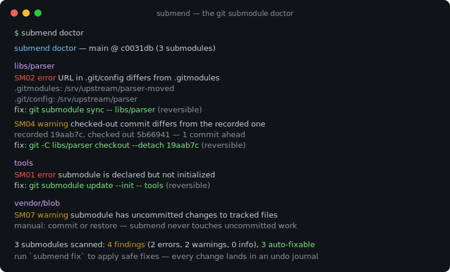
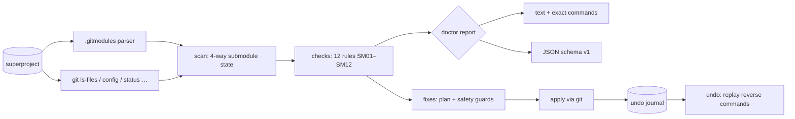

# submend

[English](README.md) | [中文](README.zh.md) | [日本語](README.ja.md)

[](LICENSE) [](go.mod) [](CHANGELOG.md)  [](CONTRIBUTING.md)

**submend：an open-source git submodule doctor — diagnoses detached heads, URL drift and dirty states with stable check IDs, explains every finding, and applies only safe fixes it can undo.**



```bash
git clone https://github.com/JaydenCJ/submend && cd submend
go build -o submend ./cmd/submend    # single static binary, stdlib only
```

> Pre-release: v0.1.0 is not tagged on a package registry yet; build from source as above (any Go ≥1.22).

## Why submend?

Submodules are the part of git people fear most, and every monorepo escapee still has them. The failure modes are always the same — a teammate's clone silently fetches from a moved URL because `.git/config` never re-reads `.gitmodules`; a local experiment leaves a submodule "1 commit ahead" and every diff shows the dreaded *new commits* noise; a detached HEAD quietly holds the only reference to real work until the next `submodule update` strands it. Git's own tooling gives you `git submodule status`, whose one-character prefixes explain nothing, or `git submodule update --init --force`, a hammer that happily discards the very commits you were trying to keep. submend is a doctor, not a hammer: it reads all four places a submodule lives (`.gitmodules`, `.git/config`, the index gitlink, the worktree clone), reports each disagreement as a stable check ID with the concrete evidence, and only ever applies fixes that are guarded against data loss — each one journaled so `submend undo` restores the previous state.

| | submend | git submodule status | git submodule update --init --force | shell aliases / wiki lore |
|---|---|---|---|---|
| Detects URL drift (.gitmodules vs .git/config vs origin) | ✅ all three, incl. relative URLs | ❌ | ❌ blind sync only | ❌ |
| Explains findings (stable IDs, background, remedy) | ✅ `explain SM01`–`SM12` | ❌ `+`/`-`/`U` prefixes | ❌ | ❌ |
| Protects uncommitted work and unreachable commits | ✅ guarded, refuses + says why | read-only | ❌ `--force` discards | ❌ |
| Undo for every applied fix | ✅ journal + `submend undo` | n/a | ❌ | ❌ |
| Machine-readable output | ✅ versioned JSON | ❌ | ❌ | ❌ |
| Runtime dependencies | 0 (Go stdlib + your git) | 0 (built-in) | 0 (built-in) | varies |

<sub>Checked 2026-07-13 against git 2.43: `git submodule status` prints only `+`/`-`/`U` state prefixes; `update --force` documents that it "discard[s] local changes in submodules when switching to a different commit".</sub>

## Features

- **Twelve targeted checks, stable IDs** — SM01–SM12 cover uninitialized paths, config/remote URL drift, out-of-sync checkouts (with ahead/behind counts), attachable detached HEADs, stranded commits, dirty worktrees, orphan gitlinks and orphan `.gitmodules` entries, embedded `.git` directories, and recorded commits missing from the clone.
- **Explained, not just flagged** — `submend explain SM06` tells you what the finding means, why it loses people's work, what the fix runs, and how the fix is undone; `doctor` prints the exact command it would run.
- **Safe by construction** — fixes refuse dirty worktrees, refuse checkouts that would strand commits (suggesting a rescue branch instead — and creating one when SM06 fires), and never touch uncommitted work.
- **Reversible with a real undo** — every applied action is journaled to `.git/submend/journal.json` with its exact reverse commands; `submend undo` replays them most-recent-first, and one-way fixes (absorbgitdirs) are labeled instead of faked.
- **Honest about relative URLs** — `../dep.git` is resolved against the superproject origin using git's own rules before any drift comparison; with no origin the check stands down rather than false-positive.
- **Scriptable** — versioned JSON (`schema_version: 1`) for `doctor` and `fix`, linter-style exit codes (info-level advice alone never fails a gate), `--dry-run`, and `--only SM02,SM04`.
- **Zero dependencies, fully offline** — Go standard library only; the sole external interface is your local `git`, and the only fetches it triggers go to remotes you already configured. No telemetry, ever.

## Quickstart

```bash
# fabricate a superproject with four classic submodule problems
bash examples/make-broken-repo.sh /tmp/submend-demo
./submend doctor /tmp/submend-demo/super
```

Real captured output:

```text
submend doctor — main @ c0031db (3 submodules)

libs/parser
  SM02  error   URL in .git/config differs from .gitmodules
        .gitmodules: /tmp/submend-demo/upstream/parser-moved
        .git/config: /tmp/submend-demo/upstream/parser
        fix: git submodule sync -- libs/parser   (reversible)
  SM04  warning checked-out commit differs from the commit the superproject records
        recorded 19aab7c, checked out 5b66941
        submodule is 1 commit ahead of the recorded commit
        fix: git -C libs/parser checkout --detach 19aab7ca9ac0ad03b4b4d33ad1a8008b0e611fd9   (reversible)

tools
  SM01  error   submodule is declared but not initialized or not cloned
        not initialized (no URL in .git/config)
        fix: git submodule update --init -- tools   (reversible)

vendor/blob
  SM07  warning submodule has uncommitted changes to tracked files
        tracked files have uncommitted modifications (git -C vendor/blob status)
        manual: Commit the changes inside the submodule (then bump the gitlink in the superproject), or discard them with `git -C vendor/blob restore .`. submend never touches uncommitted work.

3 submodules scanned: 4 findings (2 errors, 2 warnings, 0 info), 3 auto-fixable
run `submend fix` to apply safe fixes, `submend explain <ID>` for background
```

Apply the safe fixes (`submend fix`, real output, abridged to one action):

```text
submend fix — 3 actions planned

1. SM02 libs/parser — sync submodule URL from .gitmodules
     $ git submodule sync -- libs/parser
     undo: restores .git/config URL /tmp/submend-demo/upstream/parser
   applied

journal written to /tmp/submend-demo/super/.git/submend/journal.json — revert everything with `submend undo`
```

Changed your mind? `submend undo` replays the journal most-recent-first and re-attaches branches, restores URLs, and deinitializes what `fix` initialized — then removes the journal.

## Checks and fixes

Full reference with the safety guards in [docs/checks.md](docs/checks.md); the table below is the short version.

| ID | Finding | Severity | Auto-fix |
|---|---|---|---|
| SM01 | declared but not initialized/cloned | error | `update --init` (undo: `deinit`) |
| SM02 | `.git/config` URL ≠ `.gitmodules` | error | `submodule sync` (undo: restore URLs) |
| SM03 | origin remote ≠ configured URL | warning | `submodule sync` |
| SM04 | checkout ≠ recorded gitlink | warning | guarded checkout of the recorded commit |
| SM05 | detached, a branch sits at HEAD | info | attach the branch (same commit) |
| SM06 | detached, commits on no branch | warning | `submend-rescue` branch pins them |
| SM07/SM08 | dirty worktree / untracked files | warning/info | manual only, by design |
| SM09/SM10 | orphan gitlink / orphan declaration | error/warning | manual only, with guidance |
| SM11 | embedded `.git` directory | warning | `absorbgitdirs` (safe, one-way) |
| SM12 | recorded commit missing from clone | error | `submodule update` (fetch + checkout) |

## CLI reference

`submend [doctor|fix|undo|explain|version] [flags] [repo]` — `doctor` is the default. Exit codes: 0 healthy/done, 1 warnings or errors found, 2 usage error, 3 runtime error.

| Flag | Default | Effect |
|---|---|---|
| `--format` (doctor, fix) | `text` | `text` or versioned `json` |
| `--dry-run` (fix, undo) | off | plan and print, change nothing |
| `--only ID[,ID…]` (fix) | all checks | restrict fixes, e.g. `--only SM02,SM04` |

## Architecture



## Roadmap

- [x] v0.1.0 — 12 checks with stable IDs, guarded fixes, undo journal, explain, text/JSON output, 90 tests + smoke script
- [ ] Recursive diagnosis of nested submodules (`--recurse`)
- [ ] `--fix-dirty` opt-in stash-based handling for SM07 (stash, fix, reapply)
- [ ] `submodule.<name>.branch` tracking checks (declared branch vs actual)
- [ ] Shallow-clone and partial-clone awareness for SM12 remedies
- [ ] Machine-applied suggestions for SM09/SM10 (generate the exact commands)

See the [open issues](https://github.com/JaydenCJ/submend/issues) for the full list.

## Contributing

Issues, discussions and pull requests are welcome — see [CONTRIBUTING.md](CONTRIBUTING.md) for the local workflow (format, vet, tests, `SMOKE OK`). Good entry points are labelled [good first issue](https://github.com/JaydenCJ/submend/issues?q=is%3Aissue+is%3Aopen+label%3A%22good+first+issue%22), and design questions live in [Discussions](https://github.com/JaydenCJ/submend/discussions).

## License

[MIT](LICENSE)
