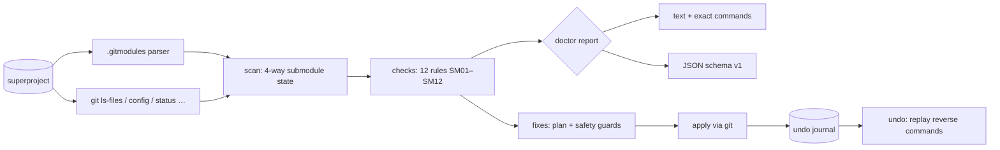

# submend

[English](README.md) | [中文](README.zh.md) | [日本語](README.ja.md)

[](LICENSE) [](go.mod) [](CHANGELOG.md)  [](CONTRIBUTING.md)

**submend：开源的 git submodule 医生——以稳定的检查 ID 诊断游离 HEAD、URL 漂移与脏工作区，解释每一条发现，并且只应用可以撤销的安全修复。**


```bash
git clone https://github.com/JaydenCJ/submend && cd submend
go build -o submend ./cmd/submend    # single static binary, stdlib only
```

> 预发布说明：v0.1.0 尚未发布到任何包仓库；请按上面的方式从源码构建（任意 Go ≥1.22）。

## 为什么选 submend？

Submodule 是 git 里最让人恐惧的部分，而每个从 monorepo 逃出来的团队手上仍然握着它们。故障模式永远是那几种——同事的克隆一直在从搬走的旧 URL 拉取，因为 `.git/config` 永远不会重读 `.gitmodules`；一次本地实验让 submodule "领先 1 个提交"，从此每个 diff 都带着烦人的 *new commits* 噪音；一个游离 HEAD 悄悄持有某些真实工作的唯一引用，直到下一次 `submodule update` 把它们抛弃。git 自带的工具只给你 `git submodule status`——单字符前缀什么也解释不了，或者 `git submodule update --init --force`——一把会开心地丢掉你正想保住的提交的大锤。submend 是医生而不是锤子：它读取 submodule 存在的全部四个位置（`.gitmodules`、`.git/config`、索引里的 gitlink、工作区克隆），把每一处分歧报告为带具体证据的稳定检查 ID，并且只应用带防丢失护栏的修复——每一步都写入日志，`submend undo` 可以恢复之前的状态。

| | submend | git submodule status | git submodule update --init --force | shell 别名 / wiki 偏方 |
|---|---|---|---|---|
| 检测 URL 漂移（.gitmodules vs .git/config vs origin） | ✅ 全部三处，含相对 URL | ❌ | ❌ 只会盲目同步 | ❌ |
| 解释发现（稳定 ID、背景、处方） | ✅ `explain SM01`–`SM12` | ❌ 只有 `+`/`-`/`U` 前缀 | ❌ | ❌ |
| 保护未提交的工作与不可达提交 | ✅ 有护栏，拒绝并说明原因 | 只读 | ❌ `--force` 直接丢弃 | ❌ |
| 每个已应用修复都可撤销 | ✅ 日志 + `submend undo` | 不适用 | ❌ | ❌ |
| 机器可读输出 | ✅ 带版本号的 JSON | ❌ | ❌ | ❌ |
| 运行时依赖 | 0（Go 标准库 + 你的 git） | 0（内置） | 0（内置） | 不一定 |

<sub>2026-07-13 基于 git 2.43 核实：`git submodule status` 只打印 `+`/`-`/`U` 状态前缀；`update --force` 的文档写明它会"在切换到不同提交时丢弃 submodule 中的本地修改"。</sub>

## 特性

- **十二项针对性检查，稳定 ID** —— SM01–SM12 覆盖未初始化路径、config/remote 两种 URL 漂移、检出与记录不一致（含领先/落后计数）、可挂接的游离 HEAD、无分支引用的孤立提交、脏工作区、孤儿 gitlink 与孤儿 `.gitmodules` 条目、内嵌 `.git` 目录、以及克隆里缺失的记录提交。
- **解释，而不只是标记** —— `submend explain SM06` 告诉你这条发现意味着什么、为什么会弄丢别人的工作、修复会执行什么、修复又如何撤销；`doctor` 直接打印将要运行的确切命令。
- **构造上就安全** —— 修复拒绝脏工作区、拒绝会孤立提交的检出（转而建议救援分支——SM06 触发时还会亲自创建一个），并且从不碰未提交的工作。
- **带真正的撤销** —— 每个已应用动作连同其精确的反向命令一起写入 `.git/submend/journal.json`；`submend undo` 按最近优先重放，单向修复（absorbgitdirs）会被如实标注而不是伪造撤销。
- **对相对 URL 诚实** —— `../dep.git` 在任何漂移比较之前先按 git 自己的规则相对超级项目 origin 解析；没有 origin 时该检查主动退让而不是误报。
- **可脚本化** —— `doctor` 与 `fix` 输出带版本号的 JSON（`schema_version: 1`）、linter 风格退出码（仅 info 级建议绝不让门禁失败）、`--dry-run`、以及 `--only SM02,SM04`。
- **零依赖，完全离线** —— 只用 Go 标准库；唯一的外部接口是你本地的 `git`，它触发的抓取也只指向你已经配置的远端。永远没有遥测。

## 快速上手

```bash
# fabricate a superproject with four classic submodule problems
bash examples/make-broken-repo.sh /tmp/submend-demo
./submend doctor /tmp/submend-demo/super
```

真实捕获的输出：

```text
submend doctor — main @ c0031db (3 submodules)

libs/parser
  SM02  error   URL in .git/config differs from .gitmodules
        .gitmodules: /tmp/submend-demo/upstream/parser-moved
        .git/config: /tmp/submend-demo/upstream/parser
        fix: git submodule sync -- libs/parser   (reversible)
  SM04  warning checked-out commit differs from the commit the superproject records
        recorded 19aab7c, checked out 5b66941
        submodule is 1 commit ahead of the recorded commit
        fix: git -C libs/parser checkout --detach 19aab7ca9ac0ad03b4b4d33ad1a8008b0e611fd9   (reversible)

tools
  SM01  error   submodule is declared but not initialized or not cloned
        not initialized (no URL in .git/config)
        fix: git submodule update --init -- tools   (reversible)

vendor/blob
  SM07  warning submodule has uncommitted changes to tracked files
        tracked files have uncommitted modifications (git -C vendor/blob status)
        manual: Commit the changes inside the submodule (then bump the gitlink in the superproject), or discard them with `git -C vendor/blob restore .`. submend never touches uncommitted work.

3 submodules scanned: 4 findings (2 errors, 2 warnings, 0 info), 3 auto-fixable
run `submend fix` to apply safe fixes, `submend explain <ID>` for background
```

应用安全修复（`submend fix`，真实输出，节选为一个动作）：

```text
submend fix — 3 actions planned

1. SM02 libs/parser — sync submodule URL from .gitmodules
     $ git submodule sync -- libs/parser
     undo: restores .git/config URL /tmp/submend-demo/upstream/parser
   applied

journal written to /tmp/submend-demo/super/.git/submend/journal.json — revert everything with `submend undo`
```

改变主意了？`submend undo` 按最近优先重放日志：重新挂回分支、恢复 URL、把 `fix` 初始化的再反初始化——然后删除日志。

## 检查与修复

含全部安全护栏的完整参考见 [docs/checks.md](docs/checks.md)；下表是速览版。

| ID | 发现 | 严重度 | 自动修复 |
|---|---|---|---|
| SM01 | 已声明但未初始化/未克隆 | error | `update --init`（撤销：`deinit`） |
| SM02 | `.git/config` URL ≠ `.gitmodules` | error | `submodule sync`（撤销：恢复 URL） |
| SM03 | origin 远端 ≠ 配置的 URL | warning | `submodule sync` |
| SM04 | 检出 ≠ 记录的 gitlink | warning | 带护栏地检出记录的提交 |
| SM05 | 游离，但有分支停在 HEAD | info | 挂接该分支（同一提交） |
| SM06 | 游离，提交不在任何分支上 | warning | `submend-rescue` 分支钉住它们 |
| SM07/SM08 | 脏工作区 / 未跟踪文件 | warning/info | 刻意只做手动指引 |
| SM09/SM10 | 孤儿 gitlink / 孤儿声明 | error/warning | 只做手动指引，附处方 |
| SM11 | 内嵌 `.git` 目录 | warning | `absorbgitdirs`（安全但单向） |
| SM12 | 记录的提交在克隆中缺失 | error | `submodule update`（抓取 + 检出） |

## CLI 参考

`submend [doctor|fix|undo|explain|version] [flags] [repo]` —— `doctor` 是默认子命令。退出码：0 健康/完成，1 存在 warning 或 error，2 用法错误，3 运行时错误。

| 标志 | 默认值 | 效果 |
|---|---|---|
| `--format`（doctor、fix） | `text` | `text` 或带版本号的 `json` |
| `--dry-run`（fix、undo） | 关 | 只规划并打印，不做任何改动 |
| `--only ID[,ID…]`（fix） | 全部检查 | 限定修复范围，如 `--only SM02,SM04` |

## 架构



## 路线图

- [x] v0.1.0 —— 12 项稳定 ID 检查、带护栏的修复、撤销日志、explain、text/JSON 输出、90 个测试 + smoke 脚本
- [ ] 嵌套 submodule 的递归诊断（`--recurse`）
- [ ] SM07 的 `--fix-dirty` 可选 stash 处理（stash、修复、重放）
- [ ] `submodule.<name>.branch` 跟踪检查（声明分支 vs 实际分支）
- [ ] SM12 处方对浅克隆与部分克隆的感知
- [ ] SM09/SM10 的机器生成建议（直接产出确切命令）

完整列表见 [open issues](https://github.com/JaydenCJ/submend/issues)。

## 参与贡献

欢迎 issue、讨论与 PR——本地工作流（格式化、vet、测试、`SMOKE OK`）见 [CONTRIBUTING.md](CONTRIBUTING.md)。入门任务标注为 [good first issue](https://github.com/JaydenCJ/submend/issues?q=is%3Aissue+is%3Aopen+label%3A%22good+first+issue%22)，设计讨论在 [Discussions](https://github.com/JaydenCJ/submend/discussions)。

## 许可证

[MIT](LICENSE)
